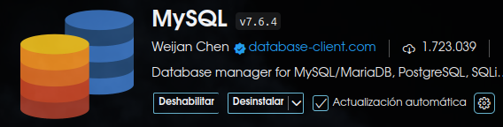

###### 🛸AsmvProject🛸

---
# Bienvenido a UniversityDB 👽️
⚠️➡︎ Base de datos totalmente funcional para la gestión y manejo de datos --> JincaDB

---
## Tabla de contenidos 📋
- [Instalación](#Instalación) 
- [¿Como usar?](#Como_usar) 
- [Tecnologías usadas](#Tecnologías)
- [Funcionalidad](#Funcionalidad)
- [Autor/es](#Autor)
---
## 👽️Hecho por:
- [Arley Mantilla](#Autor)
- [Angel Simanca](#Autor)

---
## Instalación📂
> [!TIP]
>Sigue cada uno de los siguientes pasos sin saltarte ningúno para la correcta instalación
#### Rquisitos minimos para la ejecución
- Windows 8 o superior 64-bits
- macOS Mojave (10.14) o superior
- Distribuciones de Linux como Ubuntu 20.04 y posteriores (64-bit)
- Procesador: 1 GHz o más rápido
- RAM: 4 GB (se recomienda 8 GB o más)
- Espacio en disco: 1 GB de espacio libre
- CONEXIÓN A INTERNET

#### Correcta Instalación
- Descarga o clona el actual repositorio
- Descomprime el archivo descargado
- Realiza la instalación correspondiente de MySQL
- (OPCIONAL) --> Instala Workbench
- Ejecuta cada uno de los Archivos descargados en Workbench
- (OPCIONAL) --> Instala la extención MySQL
- 
- [¿Como instalo la extención en VSCODE](https://www.youtube.com/shorts/Et1DDO4a_Ys)
- Ejecuta cada Creación, inserción y demás desde VisualStudioCode
> [!TIP]
>Ejecuta en este orden los archivos [ddl.sql --> dml.sql --> Demás]
---
## Como_usar💼
> [!WARNING]
>Asegurate de hacer cada uno de todos estos pasos...
- Realizar correcta instalación (Ejecución ddl y dml)
#### Realizar cada consulta
- Puedes hacerlo desde VisualStudioCode con la extención MySQL
- 
- Simplemente clickeamos "RUN" inicialmente al ```USE JincaDB```
- Seguido de esto, clickeamos en "RUN" a cada una de las consultas que deseemos hacer
- #### De esta manera ejecutaremos toda la DataBase, haciendo uso de la extención
- En caso que no usen la extención, podran copiar y pegar todo el contenido de la Base de Datos en el terminar de su pc, haciendo uso de MySQL en terminal
- [Tutorial de como usar MySQL en terminal Windows](https://www.youtube.com/watch?v=2N79qVfC_I8)
- [Tutorial de como usar MySQL en terminal Linux](https://www.youtube.com/watch?v=wID839p6RYE)
---
## Estructura DataBase
- Se crearon las tablas necesarias para el control y gestión de datos de JincaDB, la cual es una finca agricola
- Existen tablas tales como "Productos", "Producción" las cuales están relacionadas directa e indirectamente con un tipo especifico de los inventarios
- Tablas para el control de procesos, están relacionadas con empleados, maquinas y zonas, para saber que procesos se llevan a cabo en cada zona, que proceso hace cada empleado y cada maquina.
- Tablas como Tipos de empleados, de procesos, de cultivos, de productos, de inventarios, los cuales se relacionan con cada tabla principal de cada uno de estos, estableciendo así el tipo de cada atributo.
- Tabla de productos del proveedor, lo cual está conectado tanto con los proveedores como con los pedidos que se le hacen a cada proveedor, a demás de esto, tambien se conecta con un inventario al cual llegan todos productos comprados a proveedores.
---
## Ejemplos de Consultas
1. Esta consulta cuenta la cantidad de productos existentes en la DataBase atraves del COUNT(*)
```sql
SELECT COUNT(*) AS Cantidad_productos 
FROM productos;
```
2. Esta consulta Suma las compras totales por cada cliente.
- Suma el total de cada factura
- Une las tablas facturas, ventas y clientes con sus respectivos ID`s
- Agrupa todos los clientes dando un total
```sql
SELECT cl.nombre, SUM(total) 
FROM facturas fc
JOIN ventas vn ON fc.id_venta = vn.id_venta
JOIN clientes cl ON vn.id_cliente = cl.id_cliente 
GROUP BY cl.nombre;
```
3. Esta consulta lista todos los productos con menos de 5 unidades en el Stock
- Hace una subconsulta donde Id_producto sea menor a 5
```sql 
SELECT *
FROM productos
WHERE id_producto IN (
        SELECT id_producto
        FROM inventarios
        WHERE
            stock < 5
    );
```
---
## Contribuciones
> Arley Mantilla
- Creación Modelado E-R
- Creación Inserciones
- Realizó 50 consultas
- Creó 20 eventos
- Creó 10 funciones
- Creó ReadMe
> Angel Simanca
- Documentación Modelado
- Complemento de inserciones 
- Realizó 50 consultas
- Creó 20 procedimientos
- Creó 10 funciones
- Ajustó ReadMe
---
## Tecnologías📱
- MySQL
- StarUML
- VisualStudioCode
- Extención MySQL / Workbench

---
## Funcionalidad💭
> [!IMPORTANT]  
> Funcionalidades educativas únicamente
- Gestionar base de datos de Finca
- Visualizar relación y creacion de tablas
---
### Creación DB
- Se creó el respectivo DIAGRAMA E-R
- Se creó el respectivo DDL (Creación de base de datos,tablas y relaciones)
- Se creó el respectivo DML (Inserciones de datos)
- Se creó el respectivo DQL (COnsultas)
- Se creó el respectivo DQL_procedimientos (Procedimientos almacenados)
- Se creó el respectivo DQL_funciones (Funciones)
- Se creó el respectivo DQL_triggers (Triggers)
- Se creó el respectivo DQL_eventos (Eventos)

---
## Autor👨‍💻
#### "Codifica tus sueños"
> Arley Mantilla
- Email : 		Arleydev14@gmail.com
- LinkedIn : 	www.linkedin.com/in/arleydev14
- GitHub :		https://github.com/ArleyDev14

> Angel Simanca
- Email : 		Angelduvan1016@gmail.com
- LinkedIn : 	www.linkedin.com/in/Angelsr3
- GitHub :		https://github.com/AngelSR3